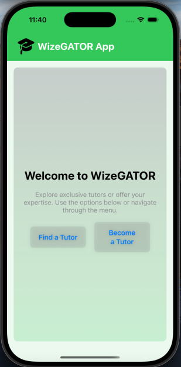
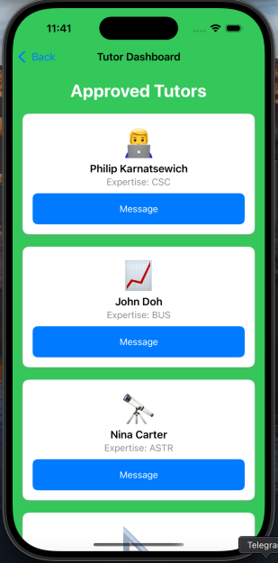
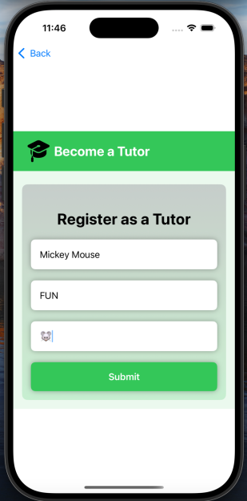
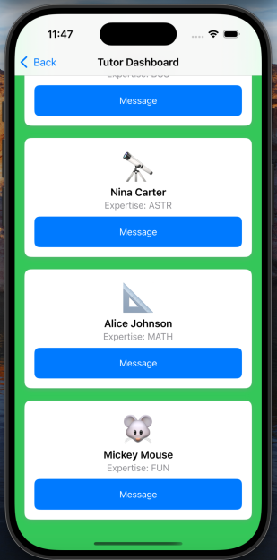
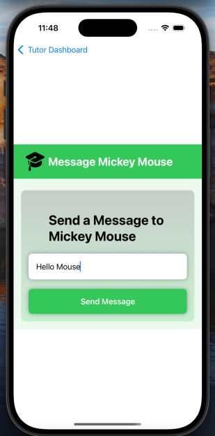

# WizeGATOR App

WizeGATOR is a mobile application that connects students with teachers in various subjects. Students can find a teacher to help them with academic or personal development or register as a teacher to share their experiences.

## Features

### 1. **Home Screen**
   - The App welcomes users with an intuitive interface.
   - Two primary options are available:
     - **Find a Tutor**: Browse and connect with tutors.
     - **Become a Tutor**: Register to offer tutoring services.

### 2. **Tutor Dashboard**
   - Displays a list of approved tutors.
   - Each tutor is shown with:
     - Name
     - Expertise area
     - Personalized image or emoji
     - A "Message" button to initiate communication with the tutor.

### 3. **Become a Tutor**
   - Users can register as a tutor by providing:
     - Name
     - Area of expertise
     - A short description or tagline
     - An optional emoji or image for personalization
   - A submission button allows users to complete the registration process.

### 4. **New Added Tutor to the Dashboard**
   - The updated Tutor Dashboard showc available tutors along with their areas of expertise.
   - Users can quickly message a tutor directly from this screen.

### 5. **Send a Message**
   - The Send a Message allows users to type and send messages to the selected tutor.
   - This feature ensures effective communication.

## Technology Used
- Utilized the Swift programming language for iOS development.
- The main goal is to focus on a user-friendly interface and simplicity.

## Getting Started
1. Download the WizeGATOR app from the App Store.
2. Open the app and choose:
   - **Find a Tutor** to explore available tutors.
   - **Become a Tutor** to register and offer your expertise.
3. Navigate the Tutor Dashboard to view approved tutors and connect with them.

